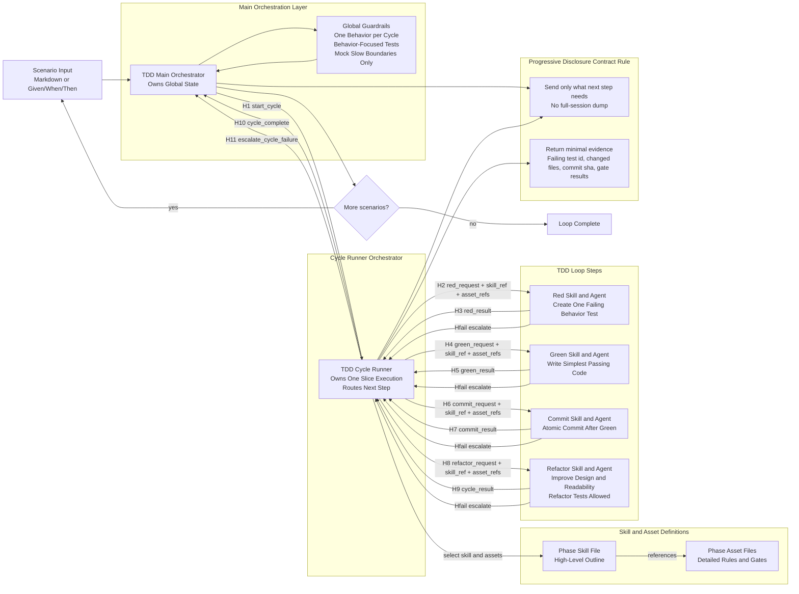

# TDD Loop Diagram: Skills, Agents, and Contracts

## Scope

- Focus only on the TDD loop.
- Use a hybrid orchestration model.
- Main orchestrator tracks global state and slice lifecycle.
- A cycle runner handles Red -> Green -> Commit -> Refactor internally.
- Each loop step is a skill and can also have a corresponding agent.
- Handoffs use JSON contracts with progressive disclosure.
- Refactor reports cycle completion to the main orchestrator.
- Any phase escalates to the cycle runner, and only the cycle runner escalates to the main orchestrator.
- The cycle runner decides and invokes each next phase based on contract results.

## Skill and Asset Packaging Model

- Each phase has a skill file with high-level operating guidance.
- Detailed phase rules live in asset files referenced by the skill file.
- Phase agents read the skill file first, then load referenced assets needed for the current step.
- The cycle runner passes only the skill id and required asset ids for the active phase.
- This keeps prompts short while preserving strict, detailed behavior rules.

### Packaging Structure

- Skill file responsibility: goals, scope boundaries, inputs and outputs, contract expectations.
- Asset file responsibility: checklists, anti-patterns, style constraints, examples, phase-specific gates.
- Agent responsibility: execute according to skill guidance and referenced assets, then return contract output.



## Phase Contract Chain

| Contract | From | To | Required Payload | Must Exclude |
|---|---|---|---|---|
| H1 `start_cycle` | Main Orchestrator | Cycle Runner | scenario slice, file scope, global guardrails, success gates | full session transcript |
| H2 `red_request` | Cycle Runner | Red | slice intent, boundary rules, test target files, `skill_ref`, `asset_refs` | implementation approach |
| H3 `red_result` | Red | Cycle Runner | failing test id, failure output, test diff | green code changes |
| H4 `green_request` | Cycle Runner | Green | failing test id, pass criteria, relevant files, `skill_ref`, `asset_refs` | future scenario backlog |
| H5 `green_result` | Green | Cycle Runner | production diff, test pass summary, status | refactor plan |
| H6 `commit_request` | Cycle Runner | Commit | green status, commit scope, commit message template, `skill_ref`, `asset_refs` | uncommitted refactor intent |
| H7 `commit_result` | Commit | Cycle Runner | commit sha, files committed, commit message | new behavior |
| H8 `refactor_request` | Cycle Runner | Refactor | committed baseline, readability goals, duplication hotspots, `skill_ref`, `asset_refs` | new scenario scope |
| H9 `cycle_result` | Refactor | Cycle Runner | refactor diff, test pass evidence, helper or builder notes | behavior expansion |
| H10 `cycle_complete` | Cycle Runner | Main Orchestrator | cycle summary, artifact pointers, next recommended action | raw internal chain chatter |
| Hfail `escalate` | Any Phase Skill | Cycle Runner | failure type, blocking evidence, recommended recovery action | unrelated context |
| H11 `escalate_cycle_failure` | Cycle Runner | Main Orchestrator | normalized failure summary, recovery options, retry point | raw phase internals not needed globally |

## Refactor Guidance

- Refactoring tests is allowed when behavior is unchanged.
- Prefer readable tests over forced duplication removal.
- Introduce helpers or builders when they improve writing and understanding future tests.

## Minimal JSON Envelope

```json
{
  "contract": "c1_red_request",
  "from": "orchestrator",
  "to": "red",
  "status": "ok",
  "focus": "single behavior slice",
  "context": {
    "scenario": "Given/When/Then slice",
    "files": ["path/to/files"],
    "constraints": ["one behavior", "boundary-level test"],
    "skill_ref": "skills/tdd/red/SKILL.md",
    "asset_refs": [
      "skills/tdd/red/assets/assertion-quality.md",
      "skills/tdd/red/assets/failure-verification.md"
    ]
  },
  "evidence": [],
  "nextAction": "red"
}
```
